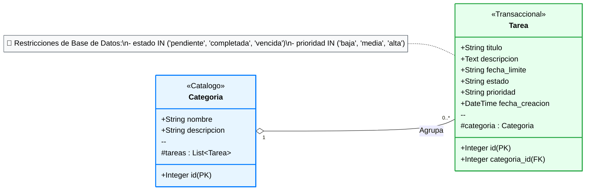

```mermaid
classDiagram
    direction LR
    %% Cambiamos a dirección Izquierda-Derecha para un diseño más equilibrado

    %% =========================================
    %% DIAGRAMA DE CLASES - SMARTTASK ORGANIZER
    %% =========================================

    class Categoria {
        <<Catalogo>>
        +Integer id (PK)
        +String nombre
        +String descripcion
        --
        #tareas : List~Tarea~
    }

    class Tarea {
        <<Transaccional>>
        +Integer id (PK)
        +String titulo
        +Text descripcion
        +String fecha_limite
        +String estado
        +String prioridad
        +DateTime fecha_creacion
        +Integer categoria_id (FK)
        --
        #categoria : Categoria
    }

    %% RELACIONES
    %% 1 Categoría -> N Tareas. Agregamos una etiqueta a la relación para mayor claridad.
    Categoria "1" o-- "0..*" Tarea : Agrupa

    %% NOTAS TÉCNICAS (Estilizada para ser profesional, no amarilla)
    note for Tarea "🔐 Restricciones de Base de Datos:\n- estado IN ('pendiente', 'completada', 'vencida')\n- prioridad IN ('baja', 'media', 'alta')"

    %% ESTILOS PROFESIONALES
    %% Clases: Colores corporativos suaves con bordes definidos
    style Categoria fill:#e7f5ff,stroke:#007bff,stroke-width:2px,color:#000
    style Tarea fill:#e6ffed,stroke:#28a745,stroke-width:2px,color:#000
    
    %% Nota: Estilo técnico gris, elegante y serio
    %% (Este comando interno fuerza el estilo de la nota)
    %%{init: {'themeVariables': { 'noteBkgColor': '#f8f9fa', 'noteBorderColor': '#6c757d' }}}%%
```