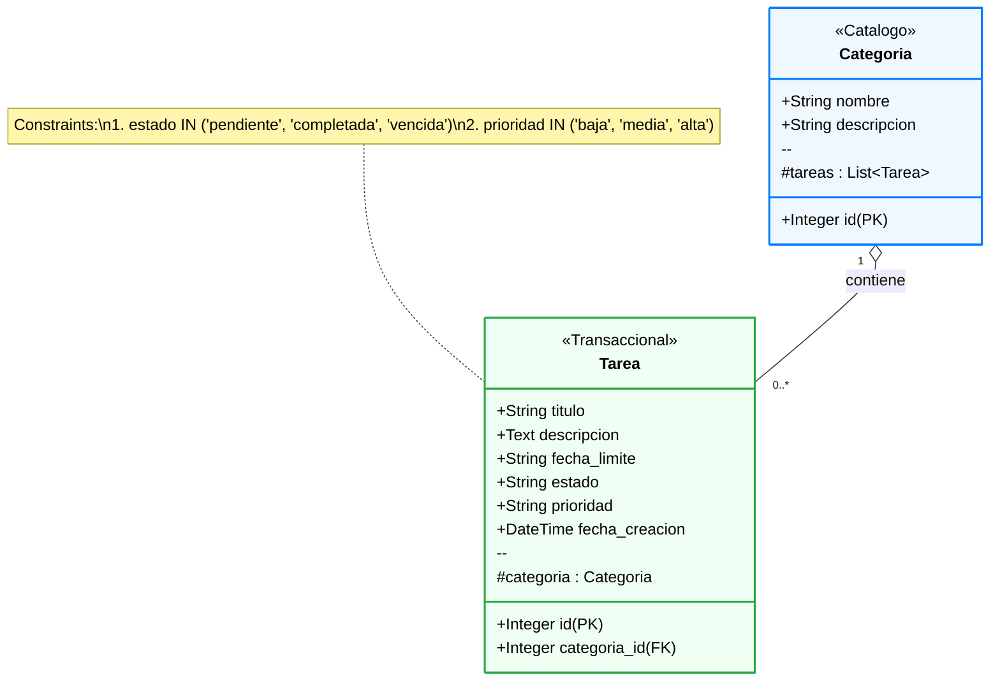

```mermaid
classDiagram
    direction TD

    %% =========================================
    %% DIAGRAMA DE CLASES - SMARTTASK ORGANIZER
    %% Nivel: Profesional / Ingeniería de Datos
    %% =========================================

    class Categoria {
        <<Catalogo>>
        +Integer id (PK)
        +String nombre
        +String descripcion
        --
        #tareas : List~Tarea~
    }

    class Tarea {
        <<Transaccional>>
        +Integer id (PK)
        +String titulo
        +Text descripcion
        +String fecha_limite
        +String estado
        +String prioridad
        +DateTime fecha_creacion
        +Integer categoria_id (FK)
        --
        #categoria : Categoria
    }

    %% RELACIONES
    %% 1 Categoría tiene N Tareas (Agregación)
    Categoria "1" o-- "0..*" Tarea : contiene

    %% NOTAS TÉCNICAS
    note for Tarea "Constraints:\n1. estado IN ('pendiente', 'completada', 'vencida')\n2. prioridad IN ('baja', 'media', 'alta')"

    %% ESTILOS
    style Categoria fill:#f0f8ff,stroke:#007bff,stroke-width:2px,color:#000
    style Tarea fill:#f0fff4,stroke:#28a745,stroke-width:2px,color:#000
```