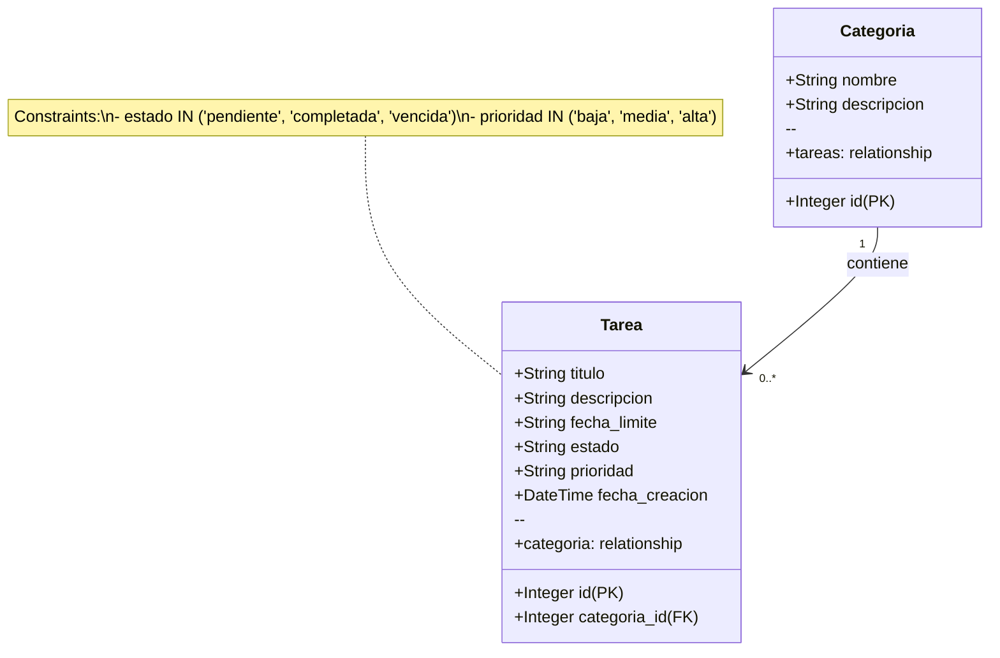

```mermaid
classDiagram
    %% Diagrama de Clases - SmartTask Organizer
    
    class Categoria {
        +Integer id (PK)
        +String nombre
        +String descripcion
        --
        +tareas: relationship
    }

    class Tarea {
        +Integer id (PK)
        +String titulo
        +String descripcion
        +String fecha_limite
        +String estado
        +String prioridad
        +DateTime fecha_creacion
        +Integer categoria_id (FK)
        --
        +categoria: relationship
    }

    %% Relación: Una Categoría tiene muchas Tareas
    Categoria "1" --> "0..*" Tarea : contiene
    
    note for Tarea "Constraints:\n- estado IN ('pendiente', 'completada', 'vencida')\n- prioridad IN ('baja', 'media', 'alta')"
```